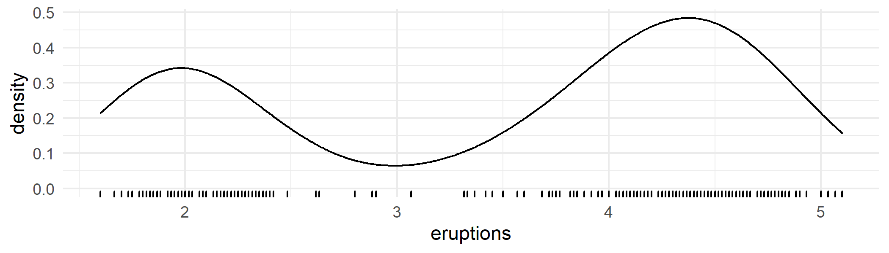
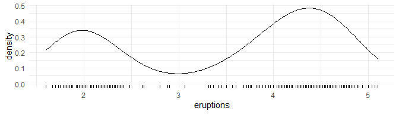

<!-- README.md is generated from README.Rmd. Please edit that file -->

# sift

<!-- badges: start -->
<!-- badges: end -->

sift facilitates **intelligent** & **efficient** exploration of
datasets.

-   `klassify` - reveals **implicit grouping** in continuous data.

-   `kollate`

-   `sift` - **augmented** dataset subsetting.

## Installation

``` r
# install.packages("devtools")
devtools::install_github("sccmckenzie/sift")
```

### `klassify`

Imagine 1D K-means, except K is chosen automatically. As an example,
consider the `faithful` dataset.

``` r
head(faithful$eruptions)
#> [1] 3.600 1.800 3.333 2.283 4.533 2.883
```

The density plot below clearly demonstrates there are **2** clusters of
eruptions.



Currently, these clusters are *implicit*, meaning we do not have a
categorical variable associating each observation with a cluster. We
could assign observations less than, say, 3.0 to Group 1 and the
remainder to Group 2.

`klassify` does this automatically - no extra inputs needed.

``` r
library(sift)

k <- klassify(faithful$eruptions)

head(k)
#> [1] 2 1 2 1 2 1
```



### `sift`

Imagine `dplyr::filter()` that includes neighboring observations.
