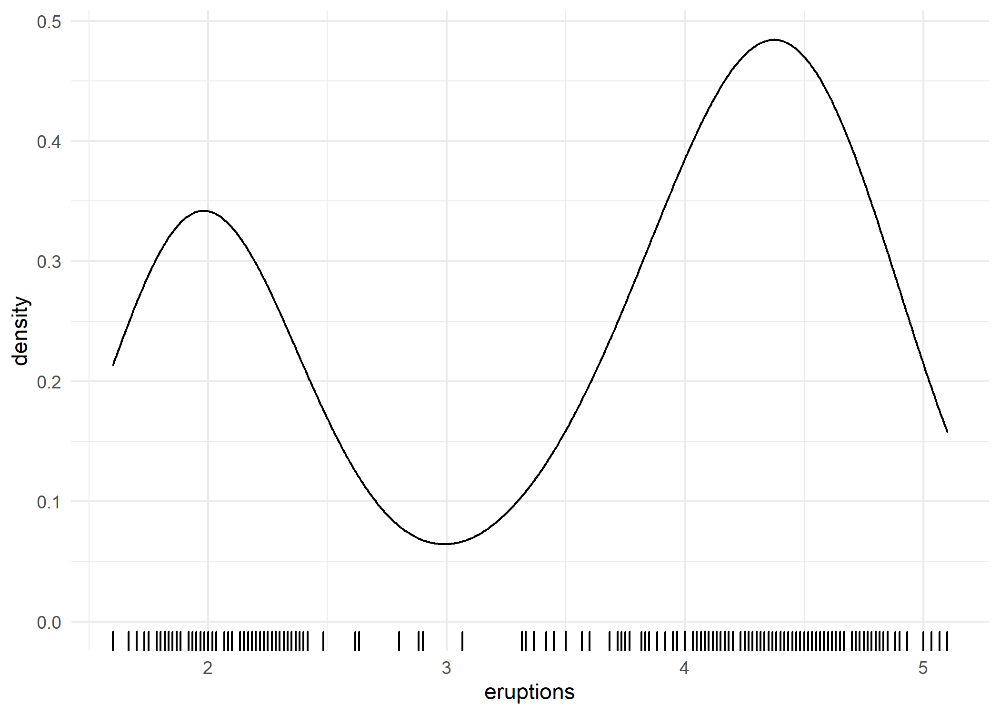
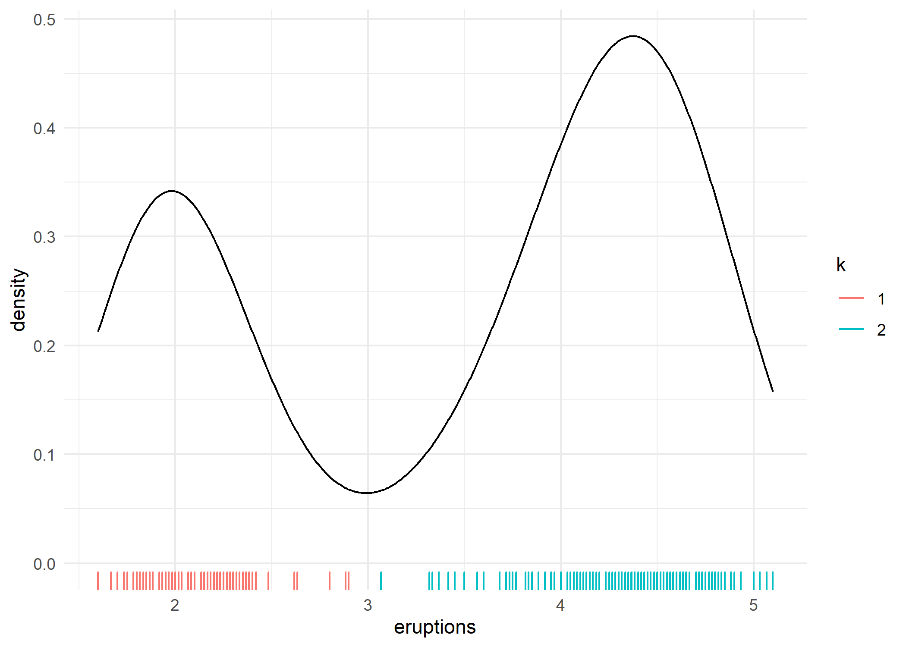

<!-- README.md is generated from README.Rmd. Please edit that file -->

# sift

<!-- badges: start -->
<!-- badges: end -->

sift facilitates **intelligent** & **efficient** exploration of
datasets.

``` r
# install.packages("devtools")
devtools::install_github("sccmckenzie/sift")
```

### `kluster`

Imagine 1D K-means, except K is chosen automatically. As an example,
consider the `faithful` dataset.

The density plot below clearly demonstrates there are **2** clusters of
eruptions.



Currently, these clusters are *implicit*, meaning we do not have a
categorical variable associating each observation with a cluster. We
could manually assign clusters by drawing a line at, say, 3.0.

`kluster` does this automatically - no extra inputs needed.

``` r
library(sift)

k <- kluster(faithful$eruptions)
```



### `sift`

Imagine `dplyr::filter()` that includes neighboring observations.
