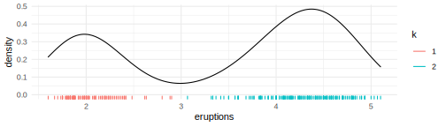

<!-- README.md is generated from README.Rmd. Please edit that file -->

# sift

<!-- badges: start -->
<!-- badges: end -->

sift facilitates **intelligent** & **efficient** exploration of
datasets.

``` r
# install.packages("devtools")
devtools::install_github("sccmckenzie/sift")
```

sift is designed to work seamlessly with tidyverse.

``` r
library(tidyverse) # needed for below examples
library(sift)
```

### 1. `sift::sift()`

##### Imagine `dplyr::filter()` that includes neighboring observations.

Perhaps you remember the Utah monolith. The buzz surrounding its
discovery (and disappearance) served as a welcome diversion from the
otherwise upsetting twists and turns of 2020.

<a title="Patrickamackie2 (Patrick A. Mackie), CC BY-SA 4.0 &lt;https://creativecommons.org/licenses/by-sa/4.0&gt;, via Wikimedia Commons" href="https://commons.wikimedia.org/wiki/File:Utah_Monolith.jpg"></a>

Suppose we are asked: *what else was happening in the world around this
time?*

Let’s peruse the `nyt2020` dataset to refresh our memory.

``` r
sift::nyt2020 %>% 
  head(10)
#> # A tibble: 10 x 7
#>    headline      abstract      byline  pub_date   section_name web_url        wt
#>    <chr>         <chr>         <chr>   <date>     <chr>        <chr>       <dbl>
#>  1 Stories Abou~ At a time wh~ By Ade~ 2020-01-01 U.S.         https://ww~     1
#>  2 Rocket Launc~ A year full ~ By Mic~ 2020-01-01 Science      https://ww~     1
#>  3 In a Deadly ~ It was a typ~ By Tim~ 2020-01-01 U.S.         https://ww~     1
#>  4 A Restaurant~ A Brooklyn w~ By Mat~ 2020-01-01 Business Day https://ww~     1
#>  5 100 Years Ag~ In 1920, Pro~ By Jen~ 2020-01-01 U.S.         https://ww~     1
#>  6 Coast Guard ~ Two of seven~ By Aim~ 2020-01-02 U.S.         https://ww~     1
#>  7 Christianity~ Mark Galli, ~ By Nic~ 2020-01-02 U.S.         https://ww~     1
#>  8 7 of Our Top~ A look back ~ By Azi~ 2020-01-02 New York     https://ww~     1
#>  9 Carlos Ghosn~ The fallen a~ By Ben~ 2020-01-02 Business Day https://ww~     1
#> 10 As India Vio~ As demonstra~ By Kai~ 2020-01-02 World        https://ww~     1
```

``` r
nyt2020 %>% 
  filter(str_detect(headline, "Monolith")) %>% 
  glimpse()
#> Rows: 1
#> Columns: 7
#> $ headline     <chr> "Monolith Discovered in Utah Desert"
#> $ abstract     <chr> "A metal monolith, planted firmly in the ground with no c~
#> $ byline       <chr> "By Storyful"
#> $ pub_date     <date> 2020-11-24
#> $ section_name <chr> "Science"
#> $ web_url      <chr> "https://www.nytimes.com/video/science/earth/100000007471~
#> $ wt           <dbl> 100
```

The monolith story broke on 2020-11-24. Prior to writing this
documentation, I certainly would not have remembered this happening in
November specifically.

Let’s take a peek at other headlines from ±2 days.

``` r
nyt2020 %>% 
  filter(pub_date > "2020-11-22",
         pub_date < "2020-11-26") %>% 
  select(headline, abstract, pub_date)
#> # A tibble: 15 x 3
#>    headline                          abstract                         pub_date  
#>    <chr>                             <chr>                            <date>    
#>  1 Biden Has Chosen a Secretary of ~ The president-elect picks an ol~ 2020-11-23
#>  2 Pat Quinn, Who Promoted A.L.S. I~ Mr. Quinn, who learned he had A~ 2020-11-23
#>  3 Business Leaders, Citing Damage ~ At the urging of New York’s att~ 2020-11-23
#>  4 Pandemic Crowds Bring ‘Rivergedd~ As urbanites flock to forests a~ 2020-11-23
#>  5 No, Joe Biden did not have a mas~ The video of a crowd singing ha~ 2020-11-23
#>  6 Monolith Discovered in Utah Dese~ A metal monolith, planted firml~ 2020-11-24
#>  7 Coronavirus in N.Y.: Latest Upda~ Upper Manhattan and the souther~ 2020-11-24
#>  8 Two Darwin Notebooks, Missing fo~ Cambridge University Library, w~ 2020-11-24
#>  9 Recent Commercial Real Estate Tr~ Recent commercial real estate t~ 2020-11-24
#> 10 Trump Administration Approves St~ A key official designated Presi~ 2020-11-24
#> 11 The C.D.C. is considering shorte~ Federal health officials may sh~ 2020-11-25
#> 12 A Poem of Gratitude From Nebraska The New York Times asked poets ~ 2020-11-25
#> 13 Casualties From Banned Cluster B~ The war in Syria, which began a~ 2020-11-25
#> 14 Iran Frees British-Australian Sc~ Iranian state media said the sc~ 2020-11-25
#> 15 A Poem of Gratitude From West Vi~ The New York Times asked poets ~ 2020-11-25
```

Notice that it took **two steps** to achieve the above result. We first
had to **find the date of the monolith story** then **perform a
subsequent call to `filter()`**. This procedure would quickly become a
nuisance after a few iterations.

`sift()` provides an interface to perform this exact process in **one
step**.

``` r
nyt2020 %>% 
  sift(pub_date, scope = 2, str_detect(headline, "Monolith")) %>% 
  select(headline, abstract, pub_date)
#> # A tibble: 15 x 3
#>    headline                          abstract                         pub_date  
#>    <chr>                             <chr>                            <date>    
#>  1 Biden Has Chosen a Secretary of ~ The president-elect picks an ol~ 2020-11-23
#>  2 Pat Quinn, Who Promoted A.L.S. I~ Mr. Quinn, who learned he had A~ 2020-11-23
#>  3 Business Leaders, Citing Damage ~ At the urging of New York’s att~ 2020-11-23
#>  4 Pandemic Crowds Bring ‘Rivergedd~ As urbanites flock to forests a~ 2020-11-23
#>  5 No, Joe Biden did not have a mas~ The video of a crowd singing ha~ 2020-11-23
#>  6 Monolith Discovered in Utah Dese~ A metal monolith, planted firml~ 2020-11-24
#>  7 Coronavirus in N.Y.: Latest Upda~ Upper Manhattan and the souther~ 2020-11-24
#>  8 Two Darwin Notebooks, Missing fo~ Cambridge University Library, w~ 2020-11-24
#>  9 Recent Commercial Real Estate Tr~ Recent commercial real estate t~ 2020-11-24
#> 10 Trump Administration Approves St~ A key official designated Presi~ 2020-11-24
#> 11 The C.D.C. is considering shorte~ Federal health officials may sh~ 2020-11-25
#> 12 A Poem of Gratitude From Nebraska The New York Times asked poets ~ 2020-11-25
#> 13 Casualties From Banned Cluster B~ The war in Syria, which began a~ 2020-11-25
#> 14 Iran Frees British-Australian Sc~ Iranian state media said the sc~ 2020-11-25
#> 15 A Poem of Gratitude From West Vi~ The New York Times asked poets ~ 2020-11-25
```

Under the hood, `sift()` passes `str_detect(headline, "Monolith")` to
`dplyr::filter()`, then augments the filtered observations to include
any rows falling in ±2 day window (specified by `pub_date` and
`scope = 2`).

### 2. `sift::kluster()`

##### Imagine 1D K-means, except K is chosen automatically.

Consider the `faithful` dataset.

Density plot below clearly demonstrates there are **2** clusters of
eruptions.


Currently, these clusters are *implicit*, meaning we do not have a
categorical variable associating each observation with a cluster. We
could manually assign clusters by drawing a line at, say, 3.0.

`kluster` does this automatically - no extra inputs needed.

``` r
k <- kluster(faithful$eruptions)
```


