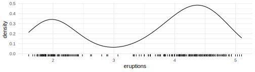

<!-- README.md is generated from README.Rmd. Please edit that file -->

# sift 

<!-- badges: start -->
<!-- badges: end -->

sift facilitates **intelligent** & **efficient** exploration of
datasets.

``` r
# install.packages("devtools")
devtools::install_github("sccmckenzie/sift")
```

sift is designed to work seamlessly with tidyverse.

``` r
library(tidyverse) # needed for below examples
library(sift)
```

### 1. `sift::sift()`

##### Imagine `dplyr::filter()` that includes neighboring observations.

Perhaps you remember the Utah monolith. The buzz surrounding its
discovery (and disappearance) served as a welcome diversion from the
otherwise upsetting twists and turns of 2020.

<a title="Patrickamackie2 (Patrick A. Mackie), CC BY-SA 4.0 &lt;https://creativecommons.org/licenses/by-sa/4.0&gt;, via Wikimedia Commons" href="https://commons.wikimedia.org/wiki/File:Utah_Monolith.jpg"></a>

Suppose we are asked: *what else was happening in the world around this
time?*

Let’s peruse the `nyt2020` dataset to refresh our memory.

``` r
nyt2020 %>% 
  filter(str_detect(headline, "Monolith")) %>% 
  glimpse()
#> Rows: 1
#> Columns: 6
#> $ headline     <chr> "Monolith Discovered in Utah Desert"
#> $ abstract     <chr> "A metal monolith, planted firmly in the ground with no c~
#> $ byline       <chr> "By Storyful"
#> $ pub_date     <date> 2020-11-24
#> $ section_name <chr> "Science"
#> $ web_url      <chr> "https://www.nytimes.com/video/science/earth/100000007471~
```

The monolith story broke on 2020-11-24. Prior to writing this
documentation, I certainly would not have remembered this happening in
November specifically.

Let’s take a peek at other headlines from ±2 days.

``` r
nyt2020 %>% 
  filter(pub_date > "2020-11-22",
         pub_date < "2020-11-26") %>% 
  select(headline, pub_date)
#> # A tibble: 15 x 2
#>    headline                                                           pub_date  
#>    <chr>                                                              <date>    
#>  1 Biden Has Chosen a Secretary of State                              2020-11-23
#>  2 Pat Quinn, Who Promoted A.L.S. Ice Bucket Challenge, Dies at 37    2020-11-23
#>  3 Business Leaders, Citing Damage to Country, Urge Trump to Begin T~ 2020-11-23
#>  4 Pandemic Crowds Bring ‘Rivergeddon’ to Montana’s Rivers            2020-11-23
#>  5 No, Joe Biden did not have a maskless birthday party last week.    2020-11-23
#>  6 Monolith Discovered in Utah Desert                                 2020-11-24
#>  7 Coronavirus in N.Y.: Latest Updates                                2020-11-24
#>  8 Two Darwin Notebooks, Missing for Decades, Were Most Likely Stolen 2020-11-24
#>  9 Recent Commercial Real Estate Transactions                         2020-11-24
#> 10 Trump Administration Approves Start of Formal Transition to Biden  2020-11-24
#> 11 The C.D.C. is considering shortening its recommended quarantine p~ 2020-11-25
#> 12 A Poem of Gratitude From Nebraska                                  2020-11-25
#> 13 Casualties From Banned Cluster Bombs Nearly Doubled in 2019, Most~ 2020-11-25
#> 14 Iran Frees British-Australian Scholar in Prisoner Swap             2020-11-25
#> 15 A Poem of Gratitude From West Virginia                             2020-11-25
```

Notice that it took **two steps** to achieve the above result. We first
had to **find the date of the monolith story** then **perform a
subsequent call to `filter()`**. This procedure would quickly become a
nuisance after a few iterations.

`sift()` provides an interface to perform this exact process in **one
step**.

``` r
nyt2020 %>% 
  sift(pub_date, scope = 2, str_detect(headline, "Monolith")) %>% 
  select(headline, pub_date)
#> # A tibble: 15 x 2
#>    headline                                                           pub_date  
#>    <chr>                                                              <date>    
#>  1 Biden Has Chosen a Secretary of State                              2020-11-23
#>  2 Pat Quinn, Who Promoted A.L.S. Ice Bucket Challenge, Dies at 37    2020-11-23
#>  3 Business Leaders, Citing Damage to Country, Urge Trump to Begin T~ 2020-11-23
#>  4 Pandemic Crowds Bring ‘Rivergeddon’ to Montana’s Rivers            2020-11-23
#>  5 No, Joe Biden did not have a maskless birthday party last week.    2020-11-23
#>  6 Monolith Discovered in Utah Desert                                 2020-11-24
#>  7 Coronavirus in N.Y.: Latest Updates                                2020-11-24
#>  8 Two Darwin Notebooks, Missing for Decades, Were Most Likely Stolen 2020-11-24
#>  9 Recent Commercial Real Estate Transactions                         2020-11-24
#> 10 Trump Administration Approves Start of Formal Transition to Biden  2020-11-24
#> 11 The C.D.C. is considering shortening its recommended quarantine p~ 2020-11-25
#> 12 A Poem of Gratitude From Nebraska                                  2020-11-25
#> 13 Casualties From Banned Cluster Bombs Nearly Doubled in 2019, Most~ 2020-11-25
#> 14 Iran Frees British-Australian Scholar in Prisoner Swap             2020-11-25
#> 15 A Poem of Gratitude From West Virginia                             2020-11-25
```

Under the hood, `sift()` passes `str_detect(headline, "Monolith")` to
`dplyr::filter()`, then augments the filtered observations to include
any rows falling in ±2 day window (specified by `pub_date` and
`scope = 2`).

### 2. `sift::break_join()`

##### Harness combined power of `dplyr::left_join()` & `findInterval()`.

Take a look at the structure of `us_uk_pop` and `us_uk_leaders` below.
How would you join these two datasets together? Specifically, we want
each row in `us_uk_pop` to contain information (`name`, `party`) for the
leader *at that time*.

``` r
us_uk_pop %>% 
  group_by(country) %>% 
  slice_head(n = 3)
#> # A tibble: 6 x 3
#> # Groups:   country [2]
#>   country date       population
#>   <chr>   <date>          <int>
#> 1 UK      1995-01-21   57997197
#> 2 UK      1996-01-19   58168519
#> 3 UK      1997-01-21   58346633
#> 4 USA     1995-01-20  268039654
#> 5 USA     1996-01-20  271231546
#> 6 USA     1997-01-19  274606475

us_uk_leaders
#> # A tibble: 11 x 4
#>    country name     start      party       
#>    <chr>   <chr>    <date>     <chr>       
#>  1 USA     Bush     1989-01-20 Republican  
#>  2 USA     Clinton  1993-01-20 Democratic  
#>  3 USA     Bush     2001-01-20 Republican  
#>  4 USA     Obama    2009-01-20 Democratic  
#>  5 UK      Thatcher 1979-05-04 Conservative
#>  6 UK      Major    1990-11-28 Conservative
#>  7 UK      Blair    1997-05-02 Labour      
#>  8 UK      Brown    2007-06-27 Labour      
#>  9 UK      Cameron  2010-05-11 Conservative
#> 10 UK      May      2016-07-13 Conservative
#> 11 UK      Johnson  2019-07-24 Conservative
```

If you look closely at the dates in `us_uk_pop`, they typically fall
around January 20th (US inauguration day). Joining by `country` &
`year(date/start)` would sweep this inconvenient detail under the rug.

For one country alone, we could use `findInterval`.

``` r
us_uk_pop %>% 
  filter(country == "USA") %>% 
  mutate(name = filter(us_uk_leaders, country == "USA")$name[findInterval(date, filter(us_uk_leaders, country == "USA")$start)])
#> # A tibble: 19 x 4
#>    country date       population name   
#>    <chr>   <date>          <int> <chr>  
#>  1 USA     1995-01-20  268039654 Clinton
#>  2 USA     1996-01-20  271231546 Clinton
#>  3 USA     1997-01-19  274606475 Clinton
#>  4 USA     1998-01-20  278053607 Clinton
#>  5 USA     1999-01-20  281419130 Clinton
#>  6 USA     2000-01-19  284594395 Clinton
#>  7 USA     2001-01-18  287532638 Clinton
#>  8 USA     2002-01-19  290270187 Bush   
#>  9 USA     2003-01-18  292883010 Bush   
#> 10 USA     2004-01-17  295487267 Bush   
#> 11 USA     2005-01-19  298165797 Bush   
#> 12 USA     2006-01-19  300942917 Bush   
#> 13 USA     2007-01-21  303786752 Bush   
#> 14 USA     2008-01-21  306657153 Bush   
#> 15 USA     2009-01-21  309491893 Obama  
#> 16 USA     2010-01-18  312247116 Obama  
#> 17 USA     2011-01-18  314911752 Obama  
#> 18 USA     2012-01-19  317505266 Obama  
#> 19 USA     2013-01-21  320050716 Obama
```

The above code is somewhat unintelligible. Additionally, there is no
straightforward way to accommodate `UK` & `USA` rows.

`break_join()` provides a simple interface leveraging functionality of
`dplyr::left_join()` and `findInterval()`.

``` r
break_join(us_uk_pop, us_uk_leaders, brk = c("date" = "start"))
#> Joining, by = "country"
#> # A tibble: 38 x 5
#>    country date       population name    party     
#>    <chr>   <date>          <int> <chr>   <chr>     
#>  1 USA     1995-01-20  268039654 Clinton Democratic
#>  2 USA     1996-01-20  271231546 Clinton Democratic
#>  3 USA     1997-01-19  274606475 Clinton Democratic
#>  4 USA     1998-01-20  278053607 Clinton Democratic
#>  5 USA     1999-01-20  281419130 Clinton Democratic
#>  6 USA     2000-01-19  284594395 Clinton Democratic
#>  7 USA     2001-01-18  287532638 Clinton Democratic
#>  8 USA     2002-01-19  290270187 Bush    Republican
#>  9 USA     2003-01-18  292883010 Bush    Republican
#> 10 USA     2004-01-17  295487267 Bush    Republican
#> # ... with 28 more rows
```

Notice that `country` was detected as a common variable (courtesy of
`dplyr::left_join()`).

Alternatively, we could have supplied `by` explicitly.

``` r
# effectively the same as above call
break_join(us_uk_pop, us_uk_leaders, brk = c("date" = "start"), by = "country")
```

Additional arguments supplied to `...` will be automatically directed to
`dplyr::left_join()` and `findInterval()`.

``` r
set.seed(1)
a <- tibble(x = 1:5, y = runif(5, 4, 6))
b <- tibble(y = c(4, 5), z = c("A", "B"))

break_join(a, b, brk = "y")
#> # A tibble: 5 x 3
#>       x     y z    
#>   <int> <dbl> <chr>
#> 1     5  4.40 A    
#> 2     1  4.53 A    
#> 3     2  4.74 A    
#> 4     3  5.15 B    
#> 5     4  5.82 B

break_join(a, b, brk = "y", all.inside = TRUE)
#> # A tibble: 5 x 3
#>       x     y z    
#>   <int> <dbl> <chr>
#> 1     5  4.40 A    
#> 2     1  4.53 A    
#> 3     2  4.74 A    
#> 4     3  5.15 A    
#> 5     4  5.82 A
```

### 3. `sift::kluster()`

##### Imagine 1D K-means, except K is chosen automatically.

Consider the `faithful` dataset.

Density plot below clearly demonstrates there are **2** clusters of
eruptions.



Currently, these clusters are *implicit*, meaning we do not have a
categorical variable associating each observation with a cluster. We
could manually assign clusters by drawing a line at, say, 3.0.

`kluster()` does this automatically - no extra inputs needed.

``` r
k <- kluster(faithful$eruptions)
```


